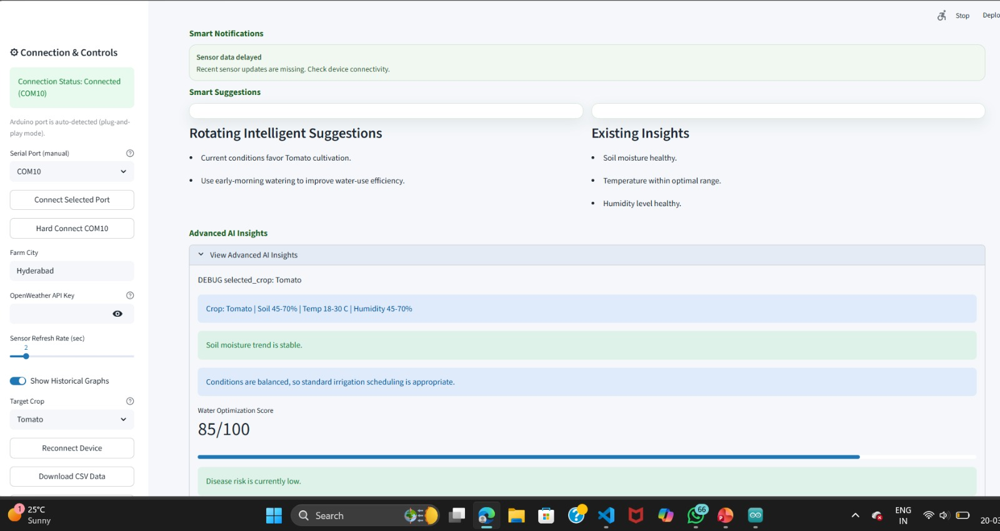
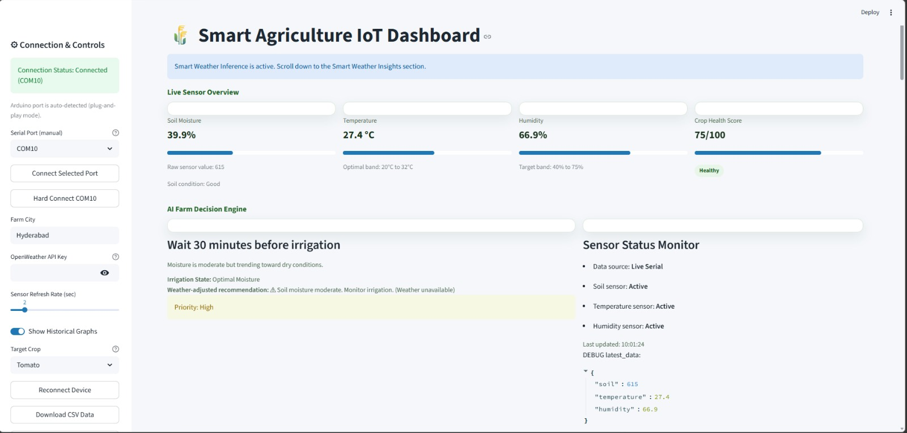

# 🌱 Smart Agriculture Dashboard

An IoT-based smart agriculture monitoring and decision-support system built using Python, Arduino, and Streamlit.

---

## 👩‍💻 Team Members
- Archana S  
- Keziah Bejoy  
- Melbha Varghese  

---

## 🚀 Project Overview

This project integrates IoT sensors with a real-time dashboard to monitor soil and environmental conditions. It provides intelligent insights, crop recommendations, and irrigation decisions to assist farmers in optimizing crop health and yield.

---

## 📸 Screenshots

  

---

## 🎥 Demo Video

Watch here: *(Add your YouTube link here)*

---

## ▶️ How to Run the Project

1. Connect Arduino with sensors (soil moisture, temperature, humidity, UV)
2. Upload the Arduino code to the board
3. Connect Arduino via serial port
4. Run the Streamlit app:
py -m streamlit run app.py

⚠️ Note: Live data will be available only when Arduino is connected.

---

## 🔌 Live IoT Integration

- Arduino-based sensor system  
- Soil moisture, temperature, humidity, and UV monitoring  
- Serial communication with Python backend  
- Auto-detection of COM ports (Arduino, CH340, CP210)  
- Real-time data streaming with error handling and reconnection  

---

## 📊 Real-Time Dashboard

- Live monitoring of:
  - Soil Moisture (%)
  - Temperature
  - Humidity
  - Crop Health Score  
- Visual indicators and progress bars  
- Soil condition labels (Dry, Optimal, Wet)  
- Sensor status tracking with timestamps  
- Auto-refresh system  

---

## 🧠 Smart Insights & Decision Engine

- Rule-based agronomy insights  
- Irrigation recommendations:
  - Irrigate immediately  
  - Wait before irrigation  
  - Optimal conditions  
- Weather-aware irrigation logic  
- Crop risk prediction:
  - Drought stress  
  - Heat stress  
  - Fungal risk  

---

## 🌾 AI-Based Features

- Crop recommendation system (Rice, Wheat, Tomato)  
- Confidence score for recommendations  
- Moisture trend prediction  
- Explainable AI decisions with reasoning  
- Water optimization scoring  

---

## 📈 Data & Analytics

- CSV-based historical data logging  
- Real-time charts using Plotly  
- Trend analysis and forecasting  
- Farm zone heatmap visualization  
- Daily statistics:
  - Average soil moisture  
  - Max temperature  
  - Min humidity  

---

## 🌦️ Weather Intelligence

- OpenWeather API integration  
- Displays:
  - Temperature  
  - Humidity  
  - Rain forecast  
- Fallback weather inference from sensor data  
- Smart weather-based irrigation insights  

---

## ❤️ Crop Health & Yield Prediction

- Health score (0–100)  
- Factors:
  - Soil moisture  
  - Temperature  
  - Humidity  
- Yield prediction:
  - High / Medium / Low  
- Disease risk detection  

---

## ⚙️ System Features

- Background serial reader with queue buffering  
- Automatic reconnection handling  
- Data deduplication  
- Simulation mode (irrigation testing)  
- User-friendly UI with sidebar controls  

---

## 🛠️ Technologies Used

- Python  
- Arduino  
- Streamlit  
- Plotly  
- Serial Communication  

---

## ⭐ Key Highlights

- Real-time IoT data streaming  
- AI-based crop health analysis  
- Smart irrigation decision system  
- Weather-integrated recommendations  
- Explainable AI outputs  

---

## 📌 Conclusion

This project demonstrates a full-stack IoT system combining hardware integration, real-time analytics, and intelligent decision-making to support smart farming practices.

---